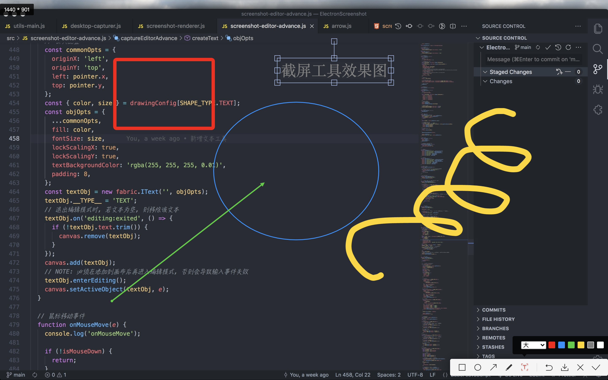

# Electron Screenshot

基于 [Electron](https://www.electronjs.org/) 开发的截屏软件.



# Runtime Environment

```
# Electron   13.1.7
# Node       14.16.0
# Chromium   91.0.4472.124
```

# Build Environment
```
# electron-builder  21.2.0
```

> 降级为固定版本 21.2.0 是因为在 Mac OS 下可能无法构建 ia32 架构, 错误信息: exited with code ERR_ELECTRON_BUILDER_CANNOT_EXECUTE. 
> 
> 若不需要在 Mac OS 下构建 Windows 应用, 则可使用最新版本.

参考资料: https://github.com/electron-userland/electron-builder/issues/4629

# Usage

```bash
# 1. 安装
npm i

# 2. 运行
npm run start
```

# Build

```bash
# 打包mac
npm run dist:mac

# 打包win
npm run dist:win
```

构建前请先看[这里](https://zhuanlan.zhihu.com/p/110448415), 解决构建源下载超时的问题.

# Todos

- [x] 截屏图片复制到剪切板
- [x] 截屏选区重置
- [x] 截屏图片下载
- [x] 截屏退出
- [x] 鼠标跟随信息 (当前坐标, 当前屏幕取色) 
- [x] 矩形框工具
- [x] 椭圆形框工具
- [x] 箭头工具
- [x] 画笔工具
- [ ] 马赛克工具🤔 (马赛克/毛玻璃)
- [x] 文字工具
- [x] 撤销工具 (操作缓存)
- [x] 工具栏图标

# Issues

- [ ] [截图图片鼠标无法隐藏](https://github.com/electron/electron/issues/7584)
- [x] [Mac-10.13.6] 截屏窗口打开后, 由于是simpleFullscreen状态, 系统菜单栏会被隐藏, 退出截屏后仍然处于隐藏状态
- 其他兼容性问题待测试